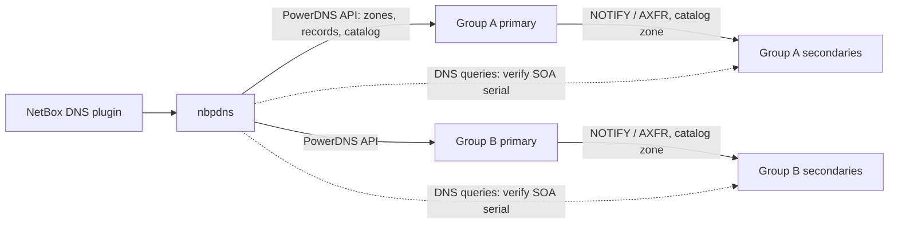

# 0007: Server groups, v1 topologies and catalog zones

## Context and problem statement

The app must "manage multiple DNS servers in various complex setups" (REQ-009).
It needs a model of which servers exist, which ones it writes to, and how the
other servers get each zone.

## Decision drivers

- Support the topologies the user runs today (Q-009).
- Write through the PowerDNS API only (ADR-0006).
- Keep the number of servers the app writes to small. Every server it writes to
  needs credentials and adds a way for a change to be only partly applied.

## Considered options

Topologies:
- primary → secondaries;
- shared-storage multi-writer;
- split-horizon views;
- independent sites and clusters.

Provisioning secondaries:
- catalog zones;
- the app calls each secondary's API;
- managed outside the app.

## Decision outcome

**Topologies (Q-009):** v1 supports
- **primary → secondaries**, including a hidden primary;
- **independent sites and clusters**.

Not in v1: shared-storage multi-writer setups and split-horizon views. Adding
either later needs a new ADR.

**Model:**

- A **server group** is one primary (the only server the app writes to) and
  zero or more secondaries.
- Each site or cluster is its own server group. How zones are assigned to a
  server group, for example by NetBox DNS view or nameserver set, is designed
  in M3.
- The app writes zones and records **only to each group's primary**, through
  its API.

**Provisioning secondaries (Q-052): catalog zones** (RFC 9432).
- The primary maintains a catalog zone listing its member zones.
- Secondaries consume the catalog, and add or remove member zones
  automatically.
- The app keeps the catalog membership in step with the zones it manages.

### Consequences

- Good: the app writes only to primaries. Secondaries need no API access and no
  credentials, and can even run other DNS software that supports catalog zones
  (BIND, Knot).
- Good: creating or deleting a zone needs no call to each secondary.
- Constraint: the primaries need PowerDNS 4.7 or later for catalog zones. The
  version range is Q-053.
- Constraint: secondaries must be configured once, outside the app, to consume
  the catalog.
- Consequence: the app verifies secondaries with **DNS queries** (SOA serial,
  sample records), not API calls. The details of verification are Q-014.

### Confirmation

- The container lab (REQ-036) has at least two server groups, each with a
  primary and a secondary. Integration tests check that a zone created in
  NetBox appears on the secondaries through the catalog.

## More information

- RFC 9432, DNS catalog zones: <https://www.rfc-editor.org/rfc/rfc9432>.
- PowerDNS catalog zone support: <https://doc.powerdns.com/authoritative/catalog.html>.
