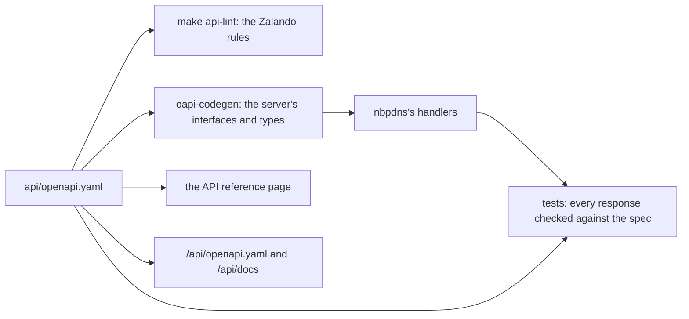

# How nbpdns's API is designed

`nbpdns serve` has an API at `/api`. It changes nothing for now: it reads,
and it receives NetBox's webhooks, which make nbpdns read again. Its clients are
scripts, and from later milestones, the web UI (M12), and the
Terraform/OpenTofu provider and Ansible collection (M18 and M19). This page explains how it's
built, how it can grow without breaking them, and what its answers mean.
[ADR-0012](../adr/0012-api-standard.md) and
[ADR-0033](../adr/0033-a-read-only-api-spec-first-generated-with-oapi-cod.md)
record the decisions, and the [API reference](../reference/api.md) lists
every operation.

## The spec comes first

The API's source of truth is one file, `api/openapi.yaml`, an OpenAPI 3.1
document. Everything else is made from it, or checked against it:

- **The server's code is generated** from the spec. A handler that answers
  with a field the spec doesn't have, or misses an operation, doesn't
  compile.
- **Every response is checked against the spec** in the tests, errors
  included: on fixtures, and on the development lab. A test fails if any
  operation, or any status code the spec lists, is never checked.
- **The reference is generated** from the spec too, so the docs can't
  drift from what the service does.
- **A linter holds the spec to the Zalando RESTful API Guidelines**, which
  the project follows in full. The one deviation, until M10, is that
  nothing is authenticated.

## Compatible, with no version in the paths

The paths have no version: there's `/api/server-groups`, never
`/api/v1/server-groups`. So a change can never break a client that worked
before:

- a field, a parameter, or a resource can be added;
- nothing is removed, renamed, or given another meaning.

The spec has its own semantic version, `info.version`, which grows with
each addition. If a change that breaks clients were ever needed, it would
come as a new media type that clients ask for, not a new path.

Clients should ignore fields they don't know, so that additions never
break them.

## Resources, and what they say

Every resource is a `GET`:

| Resource | Is |
|---|---|
| `/api/status` | The service: its build, readiness, refresh schedule, and NetBox's state |
| `/api/server-groups` | Each server group's configuration and last-known state |
| `…/zones` | A group's zones, and the primary's zones that NetBox doesn't assign |
| `…/zones/{zone}/changes` | The RRsets of a zone that differ between NetBox and the primary |
| `…/zones/{zone}/rrsets` | A zone's records as NetBox defines them |

A server group's name and a zone's name are their IDs. They're stable, so
IaC can refer to them, and import them, as M18 is to do.

The records serve IaC that reads DNS data from nbpdns, for example to
publish a zone through another provider (Q-041). nbpdns never writes
records: NetBox stays the source of truth (ADR-0004), and from M13, nbpdns
writes only to PowerDNS.

## Everything is last-known state

The API answers from what the service last read, not by reading NetBox and
PowerDNS for each request. So each answer says what it's as of:

- **A group's drift** is as of its `last_success`: the last time its
  primary was read and compared. A group whose primary fails keeps its last
  state, with its status `failed`.
- **A zone's records** are as of NetBox's last successful read, the page's
  `as_of`. They can be newer than the group's drift, if the primary failed
  while NetBox didn't.

A page is read when it's asked for. A refresh between two pages can add or
remove zones. The cursor names the last item of the page before, so the
next page starts after it, wherever it is now, and nothing that's still
there is skipped.

## Pages, cursors, and links

A list returns a page: up to `limit` items, and links to itself and to the
next page. The links are absolute, as Zalando asks, so a client follows
`next` until it's `null`, and never builds a URL. Behind a proxy,
`server.public_url` makes them point where clients connect.

A cursor isn't an offset. An offset counts items, which shift when the
list changes; a cursor names an item, which doesn't. A cursor is opaque,
and it's tied to the filters of the page that gave it: used with others,
it's a 400.

## Errors, and following a request

Every error is an RFC 9457 problem, as `application/problem+json`, with a
`detail` saying what went wrong, under `/api` and for a path or method the
API doesn't have.

Each request has an `X-Flow-ID`: the client's own, if it sends a valid
one, or a new one, which the response returns. It's the request's
`request_id` in nbpdns's logs. A request that sends a W3C `traceparent`
continues its trace, so the API's span joins the client's.

## No authentication yet, but for NetBox's webhooks

Until M10, anyone who can reach `server.listen` can read the API, as they
can read `/status` and `/metrics`. The spec says so, as an empty security
requirement, rather than hiding it. Keep the listener on a trusted network.
M10 adds tokens, and from then, the API requires them.

One operation is the exception: `POST /api/netbox-events`, which receives
NetBox's webhooks
([ADR-0036](../adr/0036-refresh-the-zones-that-netbox-s-webhooks-name-rest.md)).
Its security scheme in the spec is NetBox's signature, `X-Hook-Signature`,
the HMAC-SHA512 of the body keyed by `netbox.webhook_secret`. The server
checks it before it decodes the body, so a request that NetBox didn't sign
is refused without a word about what's in it. Until the secret is set, the
operation answers `404`.

## The reference at /api/docs

`/api/docs` is Scalar's API reference, built into the binary from a
vendored copy, reading the service's own `/api/openapi.yaml`
([ADR-0034](../adr/0034-a-vendored-locked-down-scalar-viewer-at-api-docs.md)).
Scalar's defaults would load fonts from its CDN, and its AI agent would
send the spec to its hosted service. Both are turned off, and the page's
Content-Security-Policy refuses any request to another host, so even a
later default that reaches out is blocked by the browser.

AI clients, and a later MCP server, read the spec itself, at
`/api/openapi.yaml`: every operation has an ID, every field a description
and an example.
