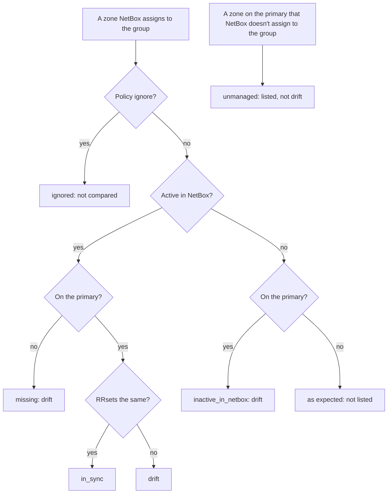

# How nbpdns finds drift

NetBox is the source of truth for DNS, and PowerDNS should serve what it
says. **Drift** is any difference between the two. `nbpdns drift` compares
the zones NetBox assigns to each server group with what the group's primary
serves, and reports every difference. This page explains what it compares,
what it leaves out and why, and how a script can tell drift from failure.
[ADR-0027](../adr/0027-report-drift-between-netbox-and-each-server-group.md)
records the decisions.

## Compare like with like

nbpdns reads NetBox and each primary into one model before it compares
them: RRsets with lowercase, absolute names, one TTL each, and values in
one canonical form
([ADR-0025](../adr/0025-normalize-record-data-with-miekg-dns-v2.md)). So
`10 mail` in NetBox and `10 Mail.Example.com.` in PowerDNS are the same `MX`
record, and aren't drift.
[How nbpdns reads NetBox](how-nbpdns-reads-netbox.md) and
[How nbpdns reads PowerDNS](how-nbpdns-reads-powerdns.md) describe the
model.

## Only what's served

Each side keeps records that it doesn't serve. NetBox has inactive records,
and PowerDNS has records turned off, which its API marks `disabled`.
nbpdns compares only what each side serves: NetBox's active records, with
the RRset's TTL, against the primary's records that aren't turned off. An
RRset with nothing served is treated as absent.

A record that neither side serves is never compared, even if its values
differ. That's deliberate: it doesn't change what anyone resolves.

## A zone's state

Each server group serves the NetBox zones in the views it lists
([ADR-0026](../adr/0026-read-powerdns-through-its-api-with-powerdns-5-1-on.md)).
For each of those zones, and each zone on the group's primary, nbpdns
decides a state:

- **`missing`:** an active zone that the primary doesn't have.
- **`inactive_in_netbox`:** a zone that isn't active in NetBox, such as one
  that's parked, but that the primary serves. NetBox says it shouldn't be
  served, so that's drift.
- **`in_sync`** and **`drift`:** a zone on both sides, with the same RRsets
  or not.
- **`ignored`:** a zone whose drift policy is `ignore`. It's listed, but not
  compared.
- **Unmanaged:** a zone that the primary has and that NetBox doesn't assign
  to the group. It's listed, but it isn't drift.

### Why unmanaged zones aren't drift

A primary often holds zones that predate nbpdns, or that another team
manages. If they were drift, every report would fail until each one was
dealt with, and a zone NetBox doesn't know about would look like something to
delete. nbpdns lists them, so that none goes unseen, and leaves the decision
to brownfield import, which adopts them from M14.

### A zone in two views

One PowerDNS server holds one zone of each name. If two of a group's views
have a zone of the same name, nbpdns compares the one in the view whose name
sorts first, and logs a warning naming both. Fix the group's views, or the
zones in NetBox.

## How RRsets differ

Within a zone, RRsets are matched by owner name and type:

| Change | Means |
|---|---|
| `missing` | NetBox has the RRset, and the primary doesn't serve it. |
| `extra` | The primary serves the RRset, and NetBox doesn't have it. |
| `changed` | Both have it, and its values or its TTL differ. |

An RRset's values are compared as a set, so their order doesn't matter. The
report gives each side's TTL and values, so you can see which differs.

### The SOA serial

Each zone's SOA is compared on every field but its serial. Both sides set
the serial themselves: NetBox's DNS plugin, by default, from the time of the
zone's last change, and PowerDNS from the date, whenever its API changes the
zone. Comparing it would
make every zone drift forever. The JSON report gives both serials, as
`netbox_serial` and `powerdns_serial`.

Every other field of the SOA counts: a different contact, name server, or
timer is drift.

## Drift policies

Each zone has a **drift policy**, set in nbpdns's config file per server
group, with overrides for single zones:

- **`report`**, the default: compare the zone and report its drift.
- **`enforce`:** the same, until M12. From then, nbpdns also corrects the
  drift on the primary. The table marks these zones `enforce (from M12)`.
- **`ignore`:** don't compare the zone.

The policy lives in nbpdns's config, not in NetBox. NetBox users can't see or
change it beside the zone, but it needs no custom field or tag in NetBox.
A policy for a zone that the group doesn't serve is a warning, not an
error: NetBox can change without nbpdns's config.
[Set a zone's drift policy](../how-to/set-a-zones-drift-policy.md) sets
them.

## Problems in the data

When nbpdns reads a value that it can't normalize, such as one that doesn't
parse as its record type, it keeps the value as given and records a
**problem**. Problems from either side are listed with the report, under
their own heading in the table and in `problems` in the JSON. They aren't
drift, but a value kept as given may not match the other side's.

## Failures and exit statuses

A report that couldn't read everything mustn't look complete:

- If NetBox can't be read, nothing can be compared, and the command fails.
- If a group's primary can't be read, that group is marked failed, with the
  reason, and the other groups are still compared and reported. The run
  still fails, since its report is incomplete.
- If `--zone` names a zone that's in none of the groups' NetBox views and on
  none of their primaries, the command fails, so that a mistyped name isn't
  reported as in sync.

The exit status tells these apart, so a script or CI job can act on it
alone:

| Status | Means |
|---|---|
| 0 | Everything was compared, with no drift. |
| 3 | Everything was compared, and there's drift. |
| 1 | Something couldn't be read, or `--zone` names a zone that's nowhere. This wins over drift. |
| 2 | The command line was wrong. |

In the JSON, `complete` says whether every group was read, and `drift`
whether any zone drifted.

## Scale

nbpdns is designed and tested for 1,000 zones and 100,000 records per run
(REQ-043). Larger targets are set when a deployment needs them.

- NetBox is read once, for every group's views together, even if several
  groups serve the same view.
- Records are read only for the zones that are compared: not for ignored or
  unmanaged zones, and with `--zone`, only for that zone. Each side's
  requests run with bounded concurrency, set by `netbox.concurrency` and
  `powerdns.concurrency`.
- The comparison itself works in memory. A benchmark compares 1,000 zones of
  100 records on each side, with 1% of the records changed, in about a tenth
  of a second, allocating about 124 MB.

## What it doesn't do yet

- **Correct drift.** nbpdns writes nothing to PowerDNS until M12, when
  `enforce` starts to act.
- **Check secondaries.** Only each group's primary is read. Secondaries copy
  their zones from it, and from M13 nbpdns checks them with DNS queries.
- **Remember.** Each run stands alone, with no history, schedule, alerts, or
  metrics. Those arrive with the service (M04) and its database (M07).
