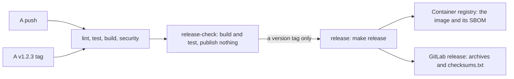

# How nbpdns is built and released

A release of nbpdns is a version tag. Every pipeline builds and tests the
release, and a tag's pipeline also publishes what it built. This page
explains how the build works, and why it's built this way. [Release
artifacts](../reference/release-artifacts.md) lists what a release holds,
and ADR-0030, ADR-0031, and ADR-0032 record the decisions.

## One build, tested in every pipeline

GoReleaser builds every release from one file, `.goreleaser.yaml`: the
binaries, their archives and checksums, and, through its ko integration,
the container image. Two make targets run it:

- `make release-check` runs in every pipeline, on both forges. It builds
  the release as a snapshot, which publishes nothing, then tests it: each
  binary is static and of its architecture, and reports the build's
  version; the checksums match; and the image runs as user 65532, with a
  read-only root file system, its labels, and no shell.
- `make release` runs only in GitLab's `release` job, only for a tag of the
  form `vMAJOR.MINOR.PATCH`. It refuses to run unless that's the only `v`
  tag on the commit, and the CHANGELOG has a section for its version. It publishes the
  image to the registry, and the archives and checksums to a GitLab
  release, with the version's section of the CHANGELOG as its notes.

So what a tag publishes is what every pipeline has built and tested since
the last release. `projctl`, which checks the CI files, allows only that
one job to publish: it must run only `make release`, and only for a version
tag.

Only the `release` job runs `make release`, but GitLab gives every job in
every pipeline the registry's credentials and a job token, with the rights
of whoever started the pipeline. So who can publish depends on GitLab's
settings, as well as on the CI file:

- with `v*` tags protected, only a maintainer can make a tag whose
  pipeline publishes a release;
- with the image's release tags protected, and duplicate packages refused,
  a pipeline that someone else starts can't push over a release's image,
  or upload files under its names.

[Make a release](../contributing/make-a-release.md) lists the settings.

## Static binaries

nbpdns is built with `CGO_ENABLED=0`, so it links no C code and loads no C
library. A binary runs on any Linux distribution, old or new, glibc or
musl, and in an image with nothing else in it. `-trimpath` leaves the build
machine's paths out of the binary, and `-ldflags=-s -w` leaves out the
symbol table and debugging information, which makes it smaller. Go's stack
traces don't need them, so a panic still names its functions and lines.

## The same bytes from the same commit

A build is reproducible: one commit builds the same archives on any
machine, so anyone can rebuild a release and compare it with its
`checksums.txt`. These make that so:

- The Go toolchain and GoReleaser are pinned: the toolchain in `go.mod`,
  and GoReleaser by its SHA-256 in `tools/tools.mk`.
- `-trimpath` keeps the build's directory out of the binary.
- Every file in an archive has the time of the commit, and is owned by
  `root`, whoever builds it, wherever.
- The image's creation time is also the time of the commit, and its base
  is pinned by digest.

## The version comes from Git

nbpdns doesn't set its version with `-ldflags -X`. The Go toolchain stamps
every build with its module version and Git commit, and `nbpdns version`
reads them back:

- a build at tag `v0.1.0` reports `v0.1.0`;
- a build of any other commit reports a pseudo-version, which names the
  commit, such as `v0.1.1-0.20261012093000-abcdef123456`;
- a build with uncommitted changes adds `+dirty`, and reports
  `modified true`.

So `make build`, `go install`, and the release all report the same version
for the same commit, and none needs a flag set to get it right.

## The image

ko builds the image from the Go build directly, with no Dockerfile and no
`docker build`: it puts the binary into a layer on top of the base image,
and builds one image for each architecture, under one multi-platform index.

The base is Debian's distroless static image, `nonroot` variant
(ADR-0031). It holds only CA certificates, time zone data, and an
`/etc/passwd` that names user 65532, `nonroot`, which is all a static
binary needs from its system. It has no shell, no package manager, and no
C library.

- **Not `scratch`:** an empty image would have no CA certificates, so
  nbpdns couldn't check NetBox's or a primary's certificate, and no user
  for 65532.
- **Not a glibc image, such as Debian's base:** nbpdns would never load
  its C library, which would still need patching, and the shell and
  package manager would be there for anyone who got into the container.

The base is pinned by its digest, so a rebuild can't pick up a different
base. Changing it is a change to `.goreleaser.yaml`, reviewed like any
other.

## SBOMs now, signing later

ko attaches an SPDX software bill of materials (SBOM) to each platform's
image, and one to the index. An image's SBOM lists the Go modules compiled
into nbpdns, with their versions, and the base image, by digest, so a
scanner can check them for known vulnerabilities without running the
image. The index's lists its images.

The archives have SHA-256 checksums. A checksum shows that a download is
the file the release listed, not who published it: nothing is signed yet.
Signing needs a key, or an identity, to be managed, and a decision on what
it protects against. M18 designs it together with the threat model:

- a cosign key is one more secret to hold and rotate;
- keyless signing through Sigstore records the GitLab instance's identity
  in a public log.

Until then, download releases from the project's GitLab, over HTTPS.
