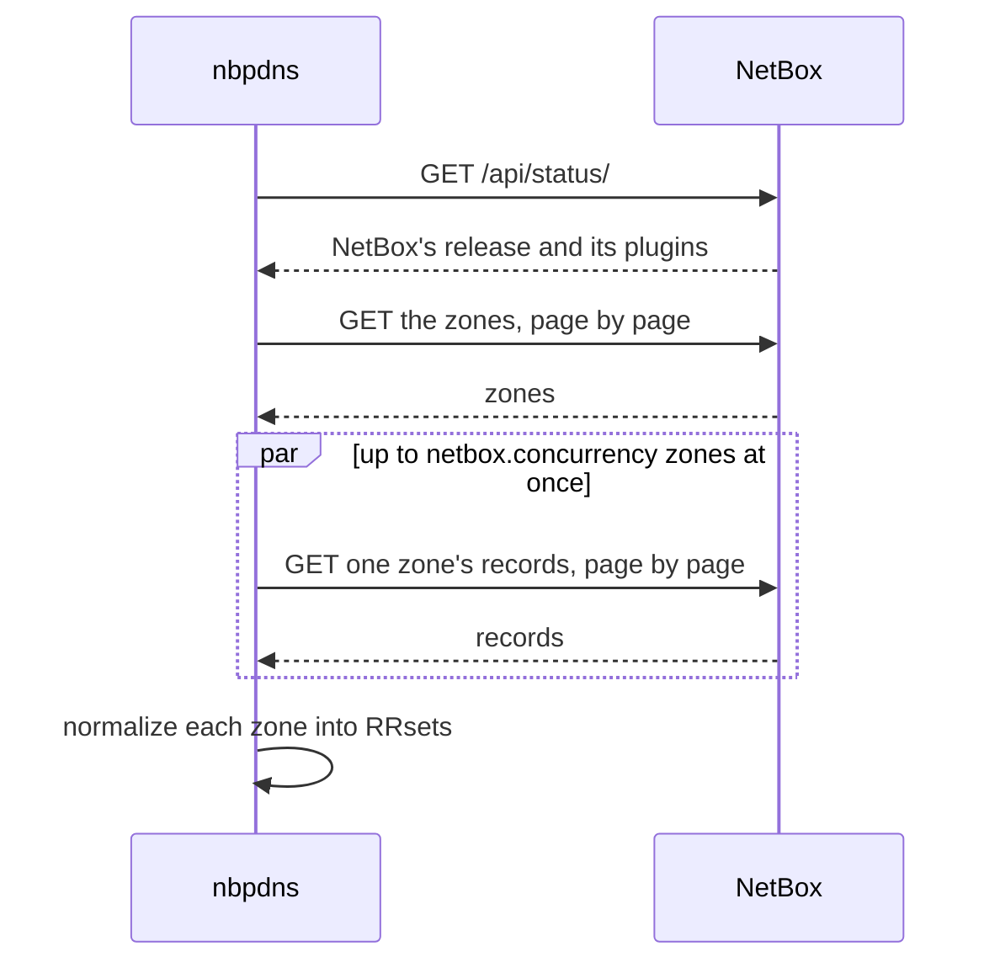

# How nbpdns reads NetBox

NetBox, with the NetBox DNS plugin, is nbpdns's source of truth for DNS data
([ADR-0004](../adr/0004-v1-scope-netbox-source-of-truth-powerdns-auth.md)).
This page explains how nbpdns reads that data, how it handles a slow or
failing NetBox, and the normalized form it puts the data in.

## The read path

1. **Status.** nbpdns first asks NetBox which release it runs, and which
   release of the DNS plugin. If the plugin isn't installed, the command
   fails. If either release isn't [supported](../reference/supported-versions.md),
   nbpdns logs a warning and carries on, since reading may still work.
   `nbpdns netbox check` counts it as a failure.
2. **Lists come in pages.** nbpdns asks for `netbox.page_size` objects at a
   time, in the order of their IDs, and follows the link NetBox gives to the
   next page. It takes only the query from that link, and keeps the rest of
   the URL it asked for. Behind a proxy, NetBox may build its links with an
   internal address, and the token must only go to the configured one.

   Paging by position skips or repeats an object if the list changes between
   two pages. NetBox gives the list's length with each page, so nbpdns can
   tell: if the length changed, or doesn't match what arrived, it reads the
   list again, up to three times, and then fails.
3. **Records are read zone by zone**, filtered by the zone's ID, with up to
   `netbox.concurrency` requests in flight. The first error stops the read,
   so a result is never missing a zone without saying so.

nbpdns only sends `GET` requests. It never changes NetBox.

## Which NetBox API it uses

NetBox also has a GraphQL API, which can fetch zones with their records in
one query. nbpdns uses REST instead
([ADR-0023](../adr/0023-netbox-client-and-normalized-dns-model-with-netbox.md)): the DNS
plugin's REST endpoints are stable, documented, and filterable, and paging
them keeps each request small. GraphQL would add a second schema and query
language to follow across NetBox releases, and its queries are harder to page
and bound.

## Slow and failing requests

- Each request has a time limit, `netbox.timeout`.
- A request is tried up to four times in all. nbpdns retries only failures
  that may pass: the statuses 429, 502, 503, and 504, and network failures
  such as a timeout or a refused or reset connection. The wait between tries
  grows from about half a second to at most 10 seconds, with some randomness
  so that clients don't retry in step. A `Retry-After` header from NetBox sets
  the wait instead, up to a minute.
- TLS failures, an unknown host name, and every other error fail at once,
  since trying again wouldn't change them.
- nbpdns doesn't follow redirects. A redirect would send the token to an
  address that the configuration didn't name, so nbpdns reports it instead,
  with where NetBox pointed.

Errors say which problem it is: NetBox can't be reached, NetBox rejected the
token, the token's user can't view an object type (named in the error), the
release isn't supported, or NetBox answered with an error of its own, which
nbpdns quotes.

NetBox refuses a bad token and a missing permission with the same status,
403. To tell them apart, nbpdns asks for NetBox's status, which needs only a
valid token: if NetBox refuses that too, the token is bad; if not, the
permission is missing.

## The connection and the token

- nbpdns uses TLS 1.2 or later. It trusts the system's certificate
  authorities, and the ones in `netbox.ca_file`. No setting turns
  certificate checks off.
- A plain `http://` URL works, because not every NetBox deployment has TLS.
  The token then crosses the network unencrypted, so nbpdns logs a warning
  each time.
- nbpdns sends a v2 token, which starts with `nbt_`, as
  `Authorization: Bearer`. A v1 token still works, sent as
  `Authorization: Token`, with a warning: NetBox recommends v2 tokens.
- The token never appears in output or logs. At the `debug` log level, nbpdns
  logs each request's path, status, attempt, and duration.
- Each request carries the W3C `traceparent` header, so a trace can follow
  nbpdns's requests into NetBox.

[Give nbpdns read-only access to NetBox](../how-to/give-nbpdns-read-only-access-to-netbox.md)
sets up a token that can only read DNS data.

## The normalized model

NetBox stores single records, each with its own TTL. PowerDNS stores
**RRsets**: all the records with one owner name and type, sharing one TTL.
nbpdns puts NetBox's data into RRsets, the form it also reads PowerDNS into,
so the drift report compares like with like.

**Views** hold **zones**, and zones hold RRsets. An RRset has one TTL and one
or more values. nbpdns normalizes the data like this:

| What | Rule |
|---|---|
| Names | Lowercase and absolute, ending with a dot. A record named `@` takes the zone's name. Internationalized names stay in their ASCII form, starting with `xn--`, as NetBox stores them. |
| Names inside values | Made absolute against the zone: the targets of `CNAME`, `DNAME`, `NS`, `PTR`, `MX`, and `SRV` records, and the two names in the `SOA` record. |
| Addresses | `A` and `AAAA` values in their canonical form, such as `2001:db8::10`. |
| `TXT` and `SPF` values | Each string in double quotes, with `"` and `\` escaped by a backslash, bytes outside printable ASCII written as `\DDD`, and one space between strings. No string is longer than 255 bytes. A value that starts with a quote is read as zone-file strings; any other value is one string. |
| Other values | Runs of spaces become one space. |
| A record's TTL | Its own, or else the zone's default TTL. |
| An RRset's TTL | The lowest TTL of its active records, or of all its records if none is active. |
| Status | Each value keeps its record's status, and whether it's active: the record and its zone both active. Inactive records are kept, and shown. |
| Managed | Records that the plugin makes itself, such as the zone's `SOA` and `NS` records, are marked managed. |

### Problems in NetBox's data

Sometimes the data needs a rule to work around it. Two cases:

- the active records of one RRset have different TTLs: the RRset takes the
  lowest;
- a value doesn't parse as its record type: it's kept as NetBox holds it.

nbpdns reports each case as a **problem**, so that it can be fixed in NetBox,
and carries on. `nbpdns netbox records` logs a warning for each problem, and
lists them under `problems` in its JSON output. Problems don't make the
command fail.

> [!NOTE]
> By default, the DNS plugin keeps each RRset's active records on one TTL
> itself, through its `enforce_unique_rrset_ttl` setting. It refuses a record
> whose TTL conflicts with the rest of its RRset, and copies a changed TTL to
> the others. So TTL problems arise only where that setting is off.

## Zone names on the command line

Commands take a zone's name in its ASCII form, such as `xn--bcher-kva.example`
for `bücher.example`, since that's how NetBox stores it. nbpdns makes the
name lowercase and drops a final dot. The same zone name can be in more than one
view; then name the view too, with `--view`.
