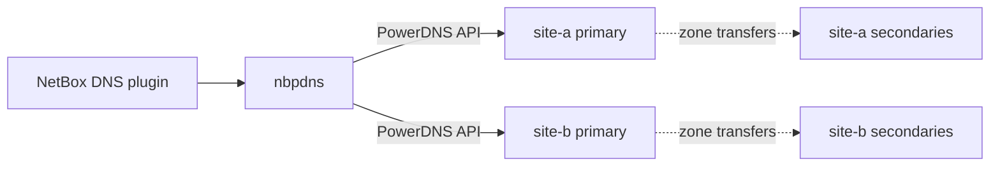

# How nbpdns reads PowerDNS

nbpdns keeps PowerDNS Authoritative servers in step with NetBox, the source of
truth. Before it can compare the two, it reads what each PowerDNS server holds,
into the same form it reads NetBox into. This page explains which servers it
reads, how NetBox's zones are assigned to them, what it reads, and why the
API key needs care.

## Server groups

nbpdns manages PowerDNS in **server groups**
([ADR-0007](../adr/0007-server-groups-and-catalog-zones.md)). A group is one
**primary**, the only server nbpdns talks to, and the **secondaries** that
copy their zones from it. Each site or cluster is its own group.

nbpdns reads, and later writes, only the primaries, through their HTTP API.
The secondaries need no API access: they get their zones from the primary,
and from M13 they learn which zones exist through catalog zones. From M14,
nbpdns checks them with DNS queries.

Server groups are declared in the config file, under `powerdns.groups`
([ADR-0026](../adr/0026-read-powerdns-through-its-api-with-powerdns-5-1-on.md)).
They're resources rather than settings, so the environment and flags can't
declare them.

## Which zones a group serves

Each group lists the **NetBox views** whose zones it serves. A NetBox zone is
served by every group that lists its view:

- one view can be served by several groups, as independent sites can serve
  the same public zones;
- when two views each have a zone of one name, such as `example.com` inside
  and outside, each of those zones goes to the groups that serve its view.

One PowerDNS server holds one zone of each name, so a group can't serve two
views that both have a zone of the same name. `nbpdns netbox zones --group`
lists the NetBox zones a group serves, and warns about such a clash.

Other ways to assign zones were considered: by the zone's name servers, which
can't tell apart groups that share them; by a NetBox tag or custom field,
which every zone would need; or by a list of zones in the config file, which
every new zone would change. Views need no change in NetBox, and match how the
DNS plugin already separates zones.

## What nbpdns reads

For each group's primary, nbpdns asks the API:

1. **What the server is.** If it isn't a PowerDNS Authoritative Server, such
   as a Recursor, the command fails. If its release isn't
   [supported](../reference/supported-versions.md#powerdns), nbpdns warns and
   carries on.
2. **Its zones:** each one's name, kind, SOA serial, and the catalog zone it
   belongs to, if any.
3. **Each zone's records**, including the ones PowerDNS keeps but doesn't
   serve, with at most `powerdns.concurrency` requests in flight.

The API doesn't page its lists, so each answer is one zone or one list of
zones. Slow and failing requests are handled as for NetBox: each has a time
limit, `powerdns.timeout`, and failures that may pass are retried, with a
growing wait.

## The same model as NetBox

PowerDNS already keeps records in **RRsets**: all the records with one owner
name and type, sharing one TTL. nbpdns reads them into the model it reads
NetBox into, so that the drift report compares like with like:

- Names are lowercase and absolute.
- Each value is parsed as its record type and written in one canonical form
  ([ADR-0025](../adr/0025-normalize-record-data-with-miekg-dns-v2.md)). The
  two sources write the same data differently: PowerDNS keeps a name's case,
  writes TLSA digests in lowercase, and leaves an HTTPS record's `alpn`
  unquoted, while NetBox may hold names relative to the zone. After
  normalization, the same data reads the same from both.
- A record that PowerDNS keeps but doesn't serve has the status `disabled`.
  It's kept and shown, as an inactive record from NetBox is.
- PowerDNS zones have no view or default TTL, and every record has its
  RRset's TTL.

## Why the API key needs care

A PowerDNS API key has no scopes. Any key can change every zone, record, TSIG
key, and DNSSEC key on its server, and through zone transfers on the group's
secondaries. Whoever has it can change what the internet resolves for every
zone in the group, such as to redirect a domain's mail, or to pass the DNS
checks that certificate authorities make.

The web server that serves the API also has no TLS of its own. Its own protections are the
address it binds to and `webserver-allow-from`, a list of the addresses it
answers. Over plain HTTP, anyone on the network path can read the key, and so
gain write access, or change the answers nbpdns gets.

So:

- nbpdns guards the key as it guards the NetBox token. It's read from the
  config file or a key file, shown as `[redacted]`, and never logged. It's
  sent only in the `X-API-Key` header, to the configured URL: nbpdns doesn't
  follow redirects.
- nbpdns supports TLS 1.2 or later, a CA file, and a client certificate. The
  reference setup puts the API behind a TLS proxy on the PowerDNS host, which
  can demand nbpdns's client certificate. The guide
  [Put the PowerDNS API behind a TLS proxy](../how-to/put-the-powerdns-api-behind-a-tls-proxy.md)
  sets it up.
- A plain `http://` URL works, since not every deployment has TLS, but nbpdns
  logs a warning each time it connects that way.

nbpdns only reads until M13, but the key it holds can always write. PowerDNS
can't give it a read-only key.
